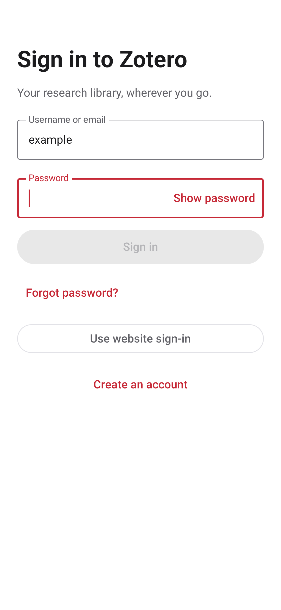
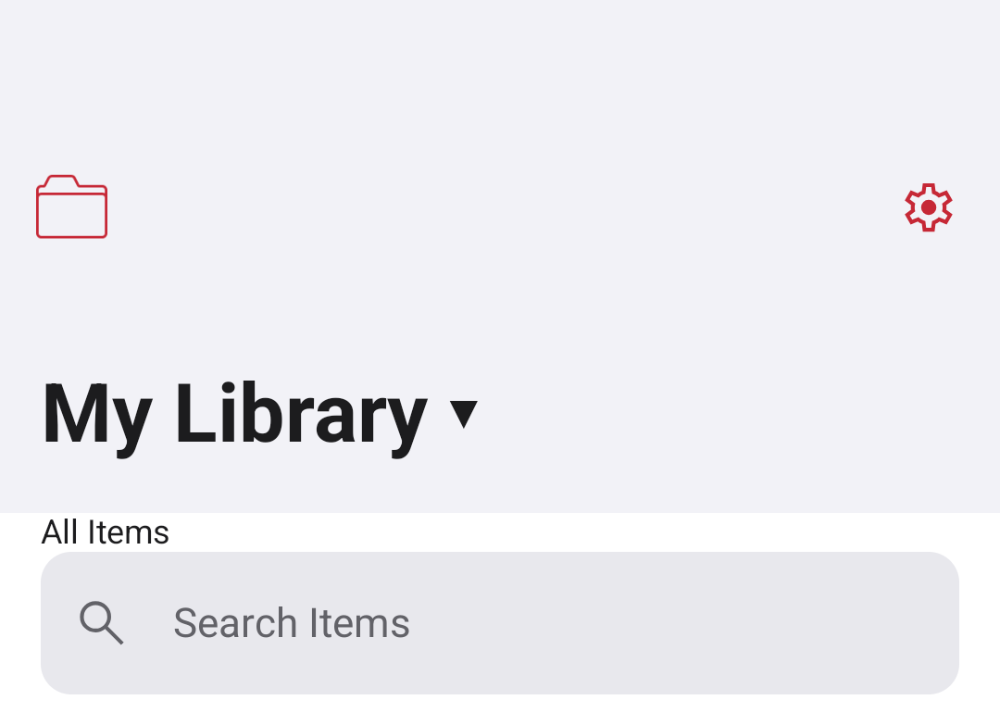
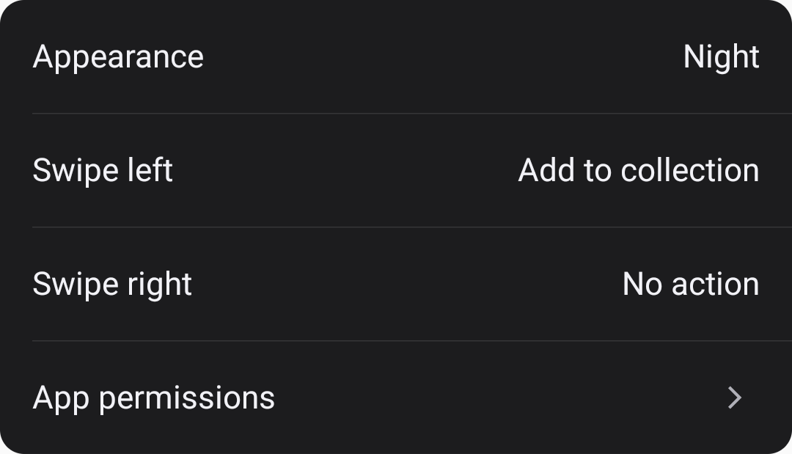
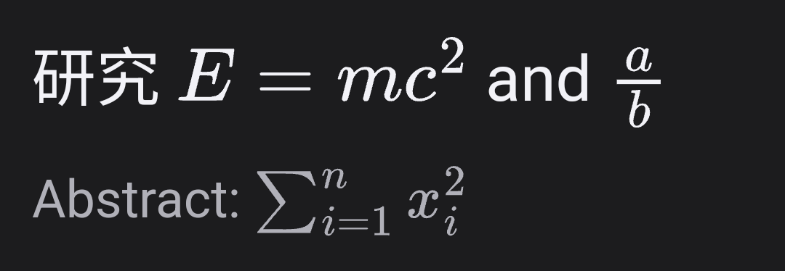

# Mobile interface update

The development package is displayed as **Zotero** and keeps its existing package ID and signing certificate. A cold start opens all items in the last available library. The title switches libraries, the upper-right gear opens settings, and a phone drawer provides collection access. The existing collection management screen remains available from the drawer. Tablet library changes also update the left navigation pane.

Native sign-in exchanges credentials for an API key through Zotero's existing `/keys` contract. Passwords are held only for the active request and are cleared from the form on submission. Authentication HTTP logging is disabled. Official website sign-in remains available for extra verification or incompatible accounts. Actual account authentication and first synchronization have not been exercised with a real account in this change; the endpoint contract and UI have isolated tests.

Device preferences persist day/night/system appearance and independent left/right card actions. Both card actions initially do nothing. Configured gestures reveal buttons; trash requires confirmation. A separate inner gutter handles page navigation, leaving the outer system back region alone. Library permissions gate card actions. Selecting More opens the existing permitted actions for the item.

The permission page reads actual camera, notification and package-install permission state, refreshes on resume and links to Android settings. Camera permission is declared without requiring camera hardware. Files continue to use Android's document picker.

Titles and new three-line abstract previews render standard TeX delimiters using the bundled MathJax 3.2.2 SVG engine. Full title/abstract rendering also appears in item details. Preview truncation removes complete tokens/formulas, and large detail equations can scroll horizontally. Non-formula text uses Compose Text. The renderer blocks network/navigation requests and untrusted HTML, limits TeX packages and expansion, caches bounded rendered output and destroys released WebViews. The edit screen retains source text.

Automatic updates now mean **check and notify**. Downloads require a tap and installation retains Android confirmation. The one-time migration ignores the former opt-out and cancels legacy automatic downloads while keeping manual transfers. The release workflow downloads the previous public APK for the data-retention check.

## Verification

The local development APK and 71 JVM tests passed during implementation. Dedicated emulator tests cover form submission, busy-state behavior, theme and gesture preferences, phone/tablet header callbacks, action reveal, gesture conflicts, actual offline MathJax SVG output, long-formula scrolling, invalid-TeX fallback and 200-row list scrolling with bounded attached WebViews. Screenshots are inspected in both light mode and 200% dark text mode. The release device matrix additionally runs the existing interaction/screenshot/update tests on API 23, 26, 33 and 36. The checked-in MathJax asset is transpiled to ES5 with offline core-js polyfills for the original API 23 WebView; its reproducible build is in `scripts/mathjax`.

Release-specific acceptance results are recorded in `docs/RELEASE-1.0.0-282.md` after publication. The project retains its existing Lint baseline; successful Lint execution is not a zero-error claim. No account database or real cloud library is used by the fixture tests. Full authenticated library switching/sync, password-manager integration across vendors and screen-reader behavior still require account/device acceptance.

## Screenshots

