# 首轮界面改版与验证记录

基线：`b5b71acd02f8771218321099b84c3c56dc00b190`。
工作分支：`codex/ios-inspired-ui`。Fork 与官方上游均已配置。
构建方法见 [DEVELOPMENT.md](../DEVELOPMENT.md)。

## 已实现的界面

文库、分类、文献列表、条目详情和设置首页从 Dashboard 统一继承
`LibraryTheme`：浅灰背景、白色分组、12dp 圆角、16dp 页面留白、红色操作控件，
深色模式使用黑灰层次。主列表使用可收起的大标题，详情采用紧凑导航栏。
系统字体保留字号缩放能力，常规文字为 16sp，辅助文字为 13sp。

共享组件位于 `app/src/main/java/org/zotero/android/uicomponents/library/`：
导航栏、分组与行、搜索框、底部操作栏、空状态与错误提示，以及统一处理
系统栏和键盘占用的 Scaffold。界面组件接收状态和回调，页面继续连接原有
ViewModel。阅读器、登录和其他未改版页面继续使用其显式主题覆盖。

文献行支持两行标题、笔记标记、附件状态、详情按钮和批量选择。文献与分类
列表使用稳定的业务标识作为 Compose key，避免元数据更新时更换行身份。
原有筛选、新增、排序、长按菜单及所有批量操作仍保留。搜索查询直接连接
现有状态，清除与取消共享同一查询值，输入时返回先关闭搜索输入。

详情按元数据、摘要、附件、笔记和标签分组。编辑页的取消和保存分别调用
已有取消与保存逻辑，系统返回在编辑模式下调用取消。作者重排索引、数据库、
同步、导入、引用、阅读器协议与导航参数未更改。设置保留账户、Quick Copy、
Cite、调试、支持和隐私六个入口。

中文文献标题和正文可正常显示。此基线不包含中文应用界面语言；新增四条
提示使用英语回退，等待纳入上游翻译目录，不声明一个只有少量文本的中文
应用语言。仅这四条新提示允许 `MissingTranslation` 回退。分类展开/收起复用
原有多语言无障碍文案，文献类型与笔记标记补充了朗读标签。

## 截图与对照

图片来自 API 35、Pixel 5 尺寸的隔离模拟器。所有文献、分类和群组名称均为
测试样例；截图使用生产 Compose 组件，未登录真实账号。文库/分类使用简化
的示例分组，详情示例覆盖标题、元数据和摘要，不能作为完整详情业务回归的
证据。原版使用同设备、同示例数据、原版主题和组件。

| 页面 | 原版 | 改版 |
| --- | --- | --- |
| 文库 | 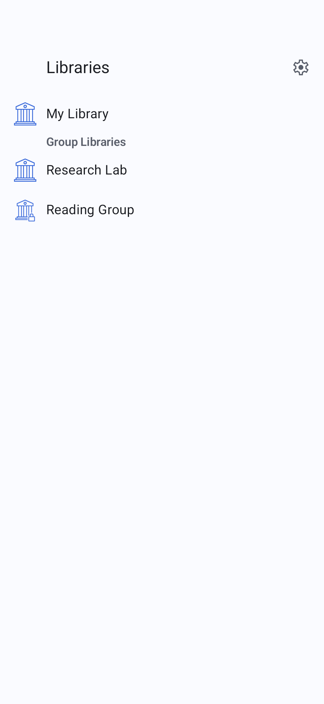 | 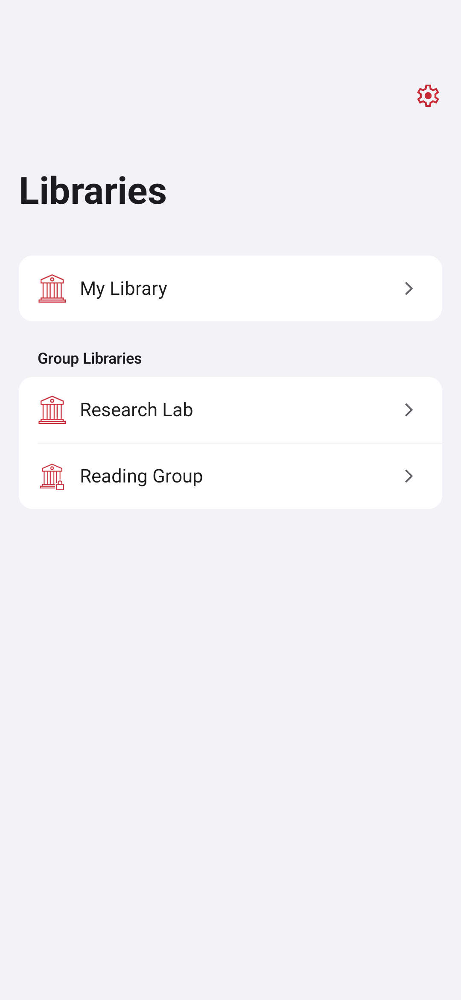 |
| 分类 | 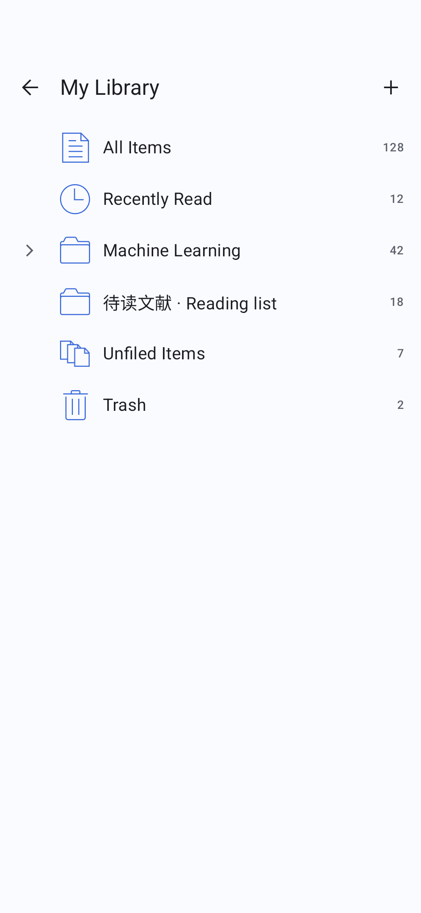 | 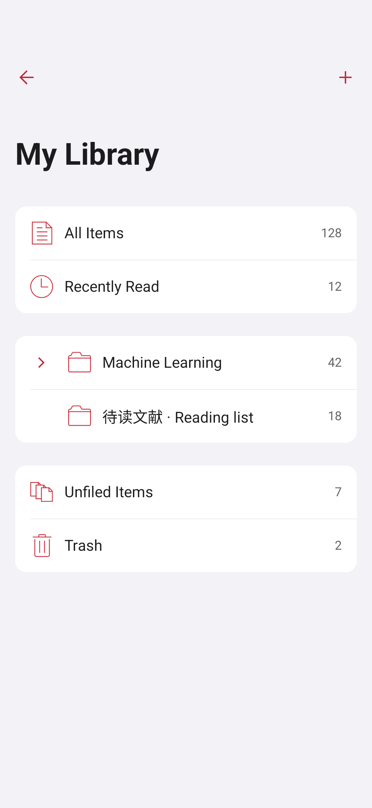 |
| 文献 | 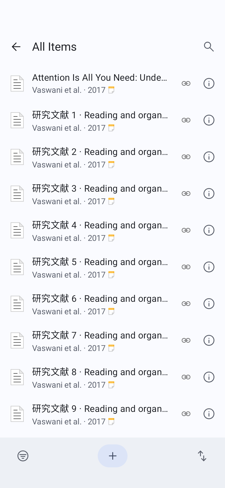 | 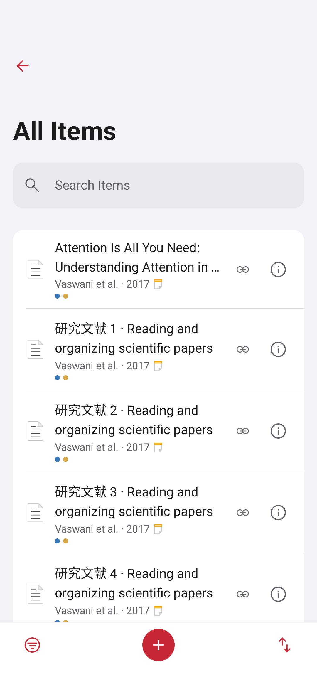 |
| 详情 | 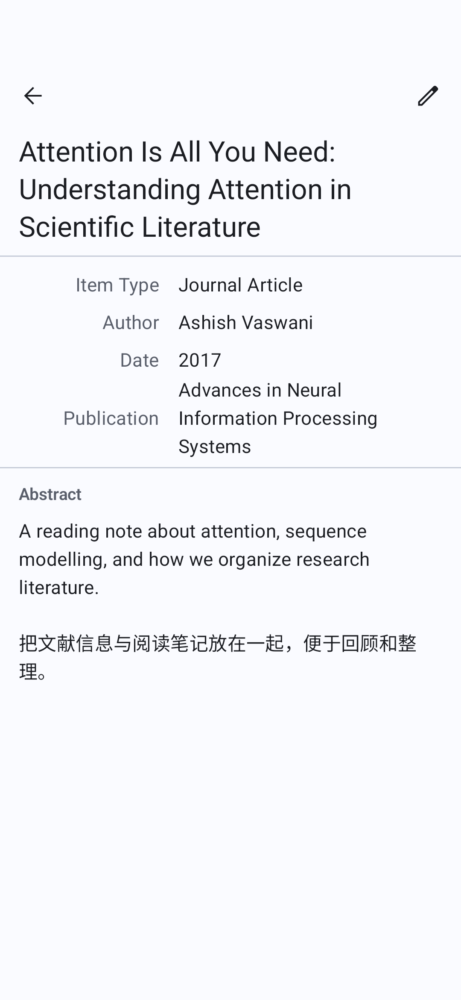 | 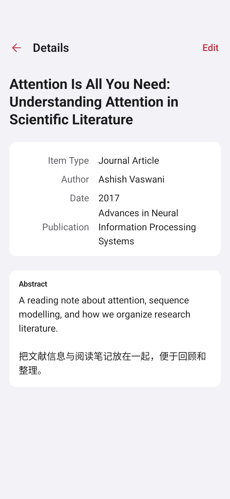 |
| 设置 | 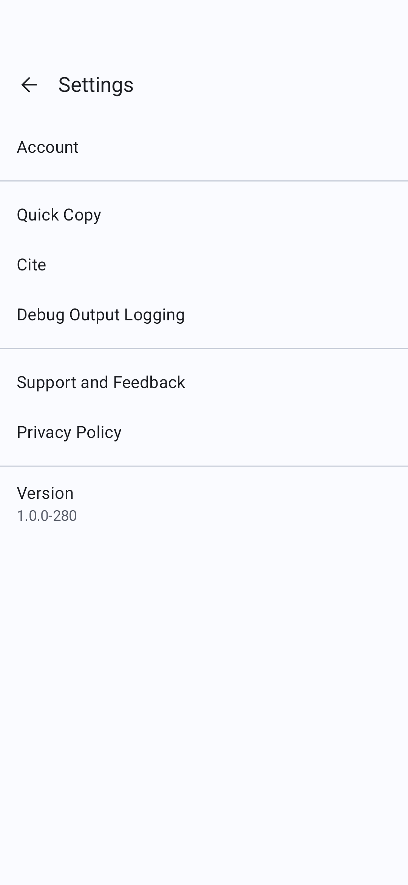 | 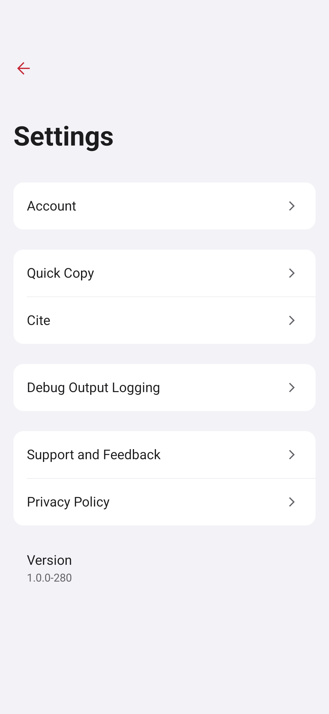 |

| 文献列表 | 深色 | 200% 字号 |
| --- | --- | --- |
|  | 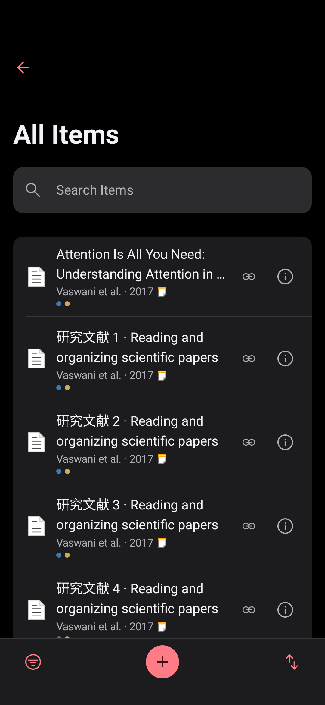 | 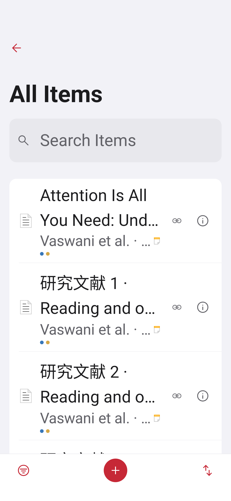 |

| 分类 | 详情 | 空列表 |
| --- | --- | --- |
|  |  | 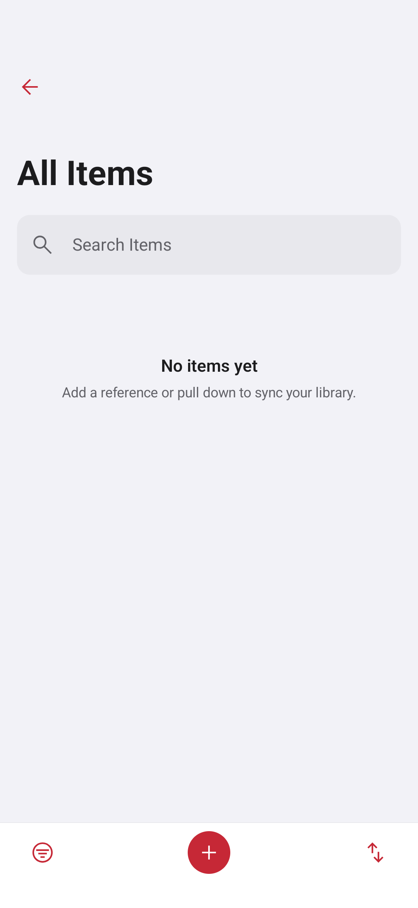 |

原版截图测试源保存在 [BaselineScreenshotTest.kt.txt](BaselineScreenshotTest.kt.txt)。
仅向基线临时副本增加测试依赖与普通 Application runner，不改原版生产 UI。

## 精简清单及依据

| 变更 | 引用审计与保留边界 |
| --- | --- |
| 删除 sample 下 5 个 Kotlin 文件及 SampleActivity Manifest 项 | `SampleActivity` 无启动 intent-filter；全仓库无指向样例的导航、Intent 或其他生产调用。SampleScreen、SampleViewModel、SampleUseCase、SamplePojo 只在样例内部互相引用。 |
| 删除 ThemeM3 的 4 套私有中/高对比配色及 ColorM3 的 140 个对应常量 | 四套方案未被主题选择代码调用；相关常量只被这四套方案引用。保留原来的浅色、深色方案及全部阅读器覆盖。 |
| 合并 CustomThemeWithStatusAndNavBars | 原实现与 CustomTheme 的 CompositionLocalProvider 完全一致，改为委托；函数签名和调用点保留。 |
| 删除核心页面的重复 AppThemeM3 包裹 | 文库、分类、文献、详情和设置均从 Dashboard 根入口继承 LibraryTheme，阅读器继续显式覆盖。 |
| 合并导航栏、分组、搜索和操作栏布局 | 保留回调入口及原 ViewModel；文库行的点击防抖和长按保持原有行为。 |
| 移除核心列表末尾固定工具栏/导航栏补偿 Spacer | LibraryScaffold 统一消费完整 content padding、系统栏和键盘 insets。 |

`CustomScaffold`、`PrimaryButton`、旧设置行等仍有生产调用，继续保留。
本轮不以删除行数作为目标，也未删除业务模块或子模块。

## 验证边界

本地已有 57 项 JVM 测试通过；20 项 Compose 检查通过（8 项交互、12 项
截图），包括搜索清除、返回处理、详情按钮与文献点击分离、多选互不干扰、
取消/保存回调分离、设置入口、200 条列表状态恢复和键盘展开后的底部可见性。
另有 1 项无密钥 PDF SDK 初始化及本地文件解析测试通过。最终修正后的运行
结果、额外显示模式检查和未完成的业务回归记录在 [VALIDATION.md](VALIDATION.md)。

保存/取消测试验证回调连接，状态恢复测试验证 Compose 保存与恢复机制；
它们不能替代真实导航图、数据库持久化与同步测试。截图中彩色标签来自
fixture；基线 ItemCellModel 的业务构建路径仍初始化为空颜色列表，本轮未
改变标签颜色的数据加载机制。

以下项目需要专用测试账户、真实测试文库或进一步设备验证：登录后同步、
导入、笔记持久化、附件下载、引用导出、完整阅读器入口、真实平板分栏导航、
屏幕阅读器完整朗读顺序，以及同设备原版/改版的滚动帧时间对比。
不将这些流程标记为已通过。

PDF SDK 依赖及无密钥初始化路径保持原状。缺少正式授权时，开发 APK 的
可安装性与界面测试通过不代表 PDF 阅读、批注、导出功能或发布授权完整。

后续移动端改版见 [Mobile interface update](MOBILE-UI.md)。
